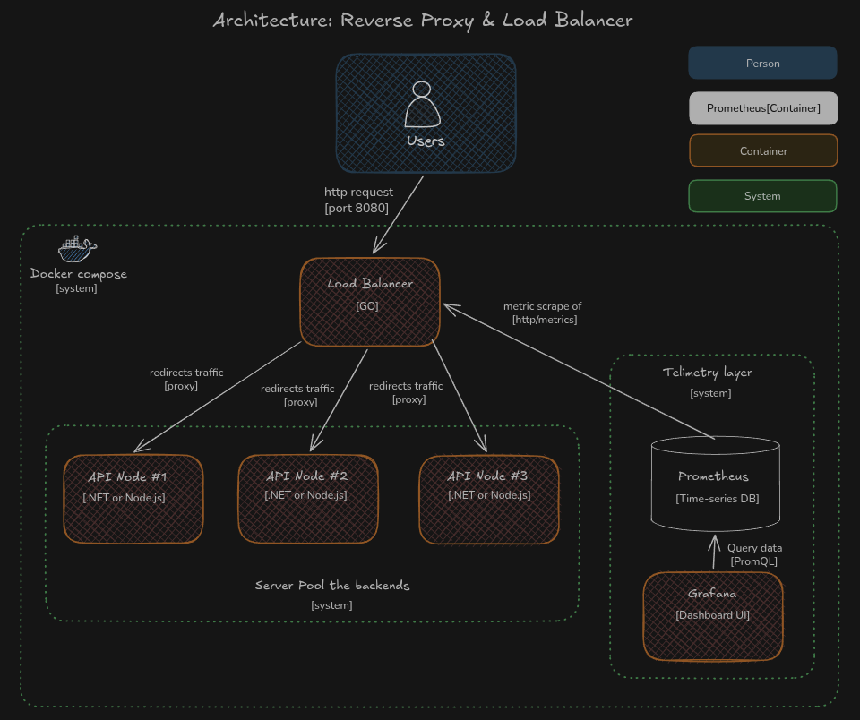
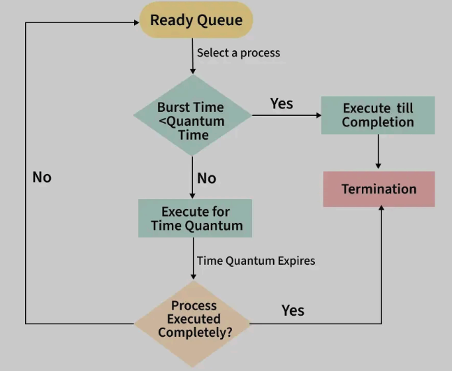
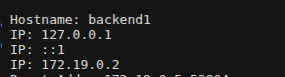
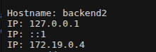
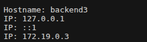
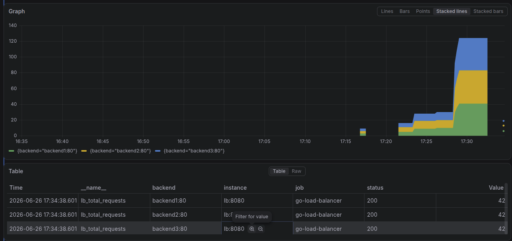

# Reverse Proxy & Load Balancer in Go


A high-performance, stateless Layer 7 Reverse Proxy & Load Balancer

## Table of Contents
1. [Architecture Overview](#architecture-overview)
2. [Round Robin Implementation](#round-robin-implementation)
3. [Infrastructure & Observability](#infrastructure--observability)
4. [Getting Started](#getting-started-quickstart)
5. [Project Structure](#project-structure)


---

## Architecture Overview

The system acts as a single ingress point, distributing incoming HTTP traffic across a pool of backend servers using a Round Robin, while ensuring thread safety under concurrent loads.



---

## Round Robin Implementation

The load balancer employs a Round Robin strategy to distribute incoming requests across the available backend pool. To ensure thread safety in a highly concurrent environment, the implementation follows these principles:

1. **Atomic Index Management:** The index tracking the next backend is managed using `sync.Mutex`, preventing race conditions when multiple incoming requests attempt to increment the index simultaneously.
2. **Circular Rotation:** The index is calculated using a modulo operation based on the number of active servers, ensuring the flow returns to the first node after reaching the end of the list.
3. **Health-Aware Selection:** Before routing, the balancer verifies the `Alive` status of the target node. If a node is marked as down by the background Health Checker, it is skipped, and the algorithm attempts to select the next healthy candidate.



For more information : [Round Robin Implementation](https://www.geeksforgeeks.org/operating-systems/round-robin-scheduling-in-operating-system/)

---

## Infrastructure & Observability

This project adopts an IaC approach. The entire cluster, including the observability layer, is containerized and orchestrated via Docker Compose.

### Traffic Distribution

### Backend #1



### Backend #2



### Backend #3



### Real-Time Telemetry with Grafana)

The proxy natively instruments Golden Signals using Prometheus metrics. Grafana is auto-provisioned to visualize this data in real time



---

## Getting Started 

Run the entire infrastructure locally with a single command

### Prerequisites
* Docker & Docker Compose 
* Git.

### Deployment Steps

1. **Clone the repository:**
   ```bash
   git clone https://github.com/renzoruiz98/go-load-balancer.git
   cd go-load-balancer
   
2. **Deploy the cluster:** 
    ```Bash
    cd deployments/compose
    docker compose up -d --build

3. **Test the Load Balancer:**

    Open your browser and navigate to http://localhost:8080. Refresh multiple times to see the routing in action.

4. **Access the Observability Dashboard:**

   Navigate to http://localhost:3000 with default credentials: admin / admin

